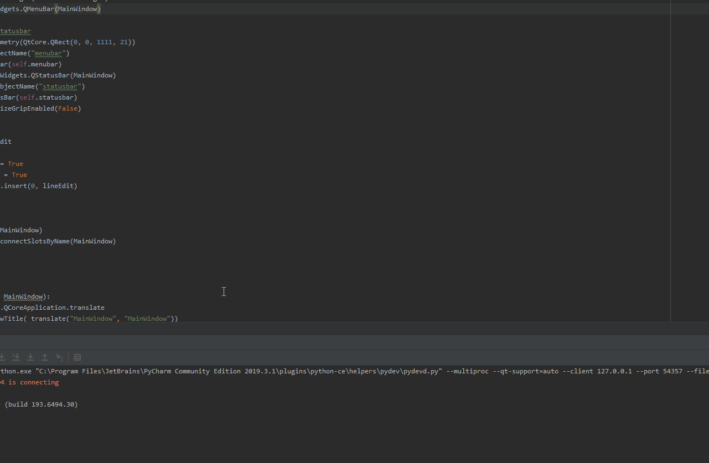

### What is this?
A small coding project made over winter break; meant to combine the ease of microsoft sticky notes and the utility of a command prompt, with some extra features :)
### When will this be completed?
Currently it's in a very very early phase of development, but right now this is how it looks like:

### Can I try it?
Of course! there's a precompiled version in the [Releases](https://github.com/bmollusk/stickiernotes/releases) section, 
and if you would rather compile it yourself you can with these steps:
1. Have [the latest version](https://www.python.org/downloads/) of python
2. Download the source code for this project
3. Open a command prompt in the install directory and run the following command:
```cmd
pip3 install -r requirements.txt
```
4. Now you should just be able to do:
```cmd
python3 mainguiv8.py
```
and get running!
### What are the current features?
Currently we have implemented:
1. Autosaving, so even if your laptop crashes your notes along with all the commands and outputs will remain!
2. Always on top behavior so you can take notes while having a zoom call in the background
3. Multiple windows so you can organize your notes if one becomes too cluttered
4. Command system, so you're not limited to just typing regular notes, and can run commands with output that updates to changes in the command
5. Reference system, so you can reference the results of your commands, or even other lines, for quick adaptive notetaking
6. Quick Command system, so you can quickly add a command in the middle of a line of text, for doing a quick calculation in the middle of taking notes
### What are some expected features?
The priority atm for first alpha release is:
1. Allow for modularity with commands so a beginner can be expected to make their own commands
2. Multiple commands ranging from google queries to quick reminders
